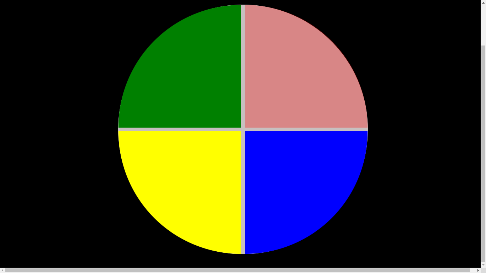
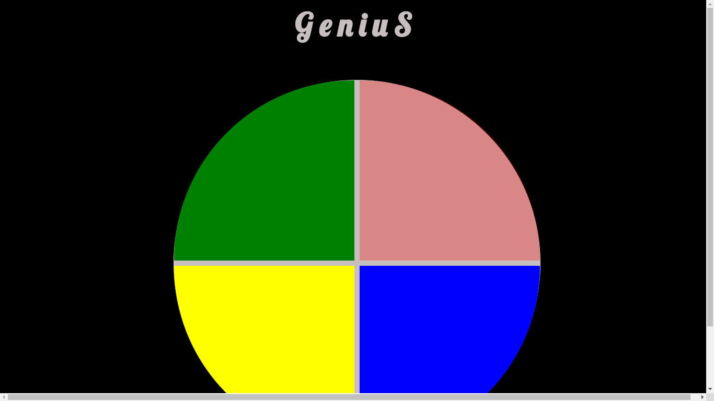
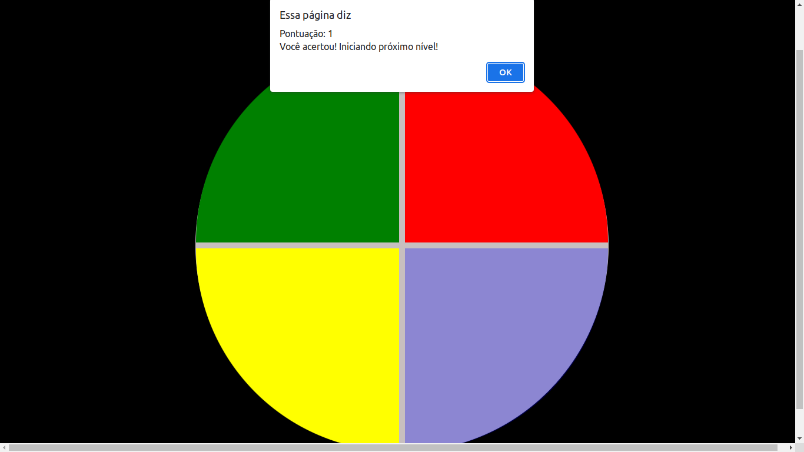

# GeniusJs
# Oi, tudo bem?  🙃  

#### Esse é o repositório da aula de Javascript na Digital Innovation One , na qual eu fiz um simples jogo chamado Genius com apenas algumas linhas de código que foram essenciais para a sedimentação dos meus conhecimentos em estrutura de loop for em JavaScript além dá criação e chamada de funções!

  <a href="https://github.com/Victor160197">
  
  
  

